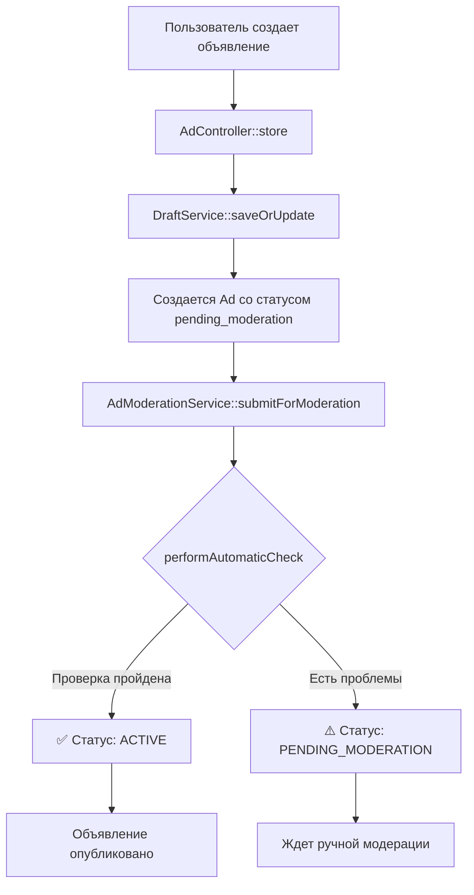

# 🔍 Где находится автоматическая проверка объявлений

## 📍 Расположение в проекте

### 1️⃣ **Основной сервис модерации**
```
📁 /app/Domain/Ad/Services/AdModerationService.php
```

#### Метод `performAutomaticCheck()` (строка 234)
Это главный метод автоматической проверки:

```php
private function performAutomaticCheck(Ad $ad): array
{
    $issues = [];
    $approved = true;

    // 1. Проверка контента на стоп-слова
    $contentIssues = $this->checkContent($ad);
    
    // 2. Проверка фотографий
    $photoIssues = $this->checkPhotos($ad);
    
    // 3. Проверка цен
    $priceIssues = $this->checkPricing($ad);
    
    // 4. Проверка контактов
    $contactIssues = $this->checkContacts($ad);

    return [
        'approved' => $approved,  // true = автоодобрено, false = на модерацию
        'issues' => $issues       // список найденных проблем
    ];
}
```

### 2️⃣ **Job для фоновой модерации** (НЕ ИСПОЛЬЗУЕТСЯ!)
```
📁 /app/Jobs/AutoModerateAdJob.php
```

⚠️ **ВАЖНО:** Этот Job создан, но **НИГДЕ НЕ ВЫЗЫВАЕТСЯ** в проекте!
Он должен был запускаться через 5 минут после создания объявления, но dispatch отсутствует.

---

## 🔄 Как работает автоматическая проверка сейчас

### Процесс создания объявления:



### Что проверяется автоматически:

#### 1. **Контент** (`checkContent()`)
```php
// Стоп-слова (строка 21-24)
private array $bannedWords = [
    'наркотики', 'оружие', 'проституция', 
    'интим', 'секс', 'эскорт'
];

// Подозрительные паттерны (строка 27-32)
private array $suspiciousPatterns = [
    '/\b100%\s+(гарантия|результат)\b/iu',
    '/\bбез\s+предоплат[ыи]\b/iu',
];

// Проверки:
✅ Наличие запрещенных слов
✅ Подозрительные фразы (регулярки)
✅ Минимальная длина описания (50 символов)
✅ Избыток КАПСА (>50% заглавных)
```

#### 2. **Фотографии** (`checkPhotos()`)
```php
✅ Проверка наличия фото
❌ НЕТ проверки содержимого (NSFW, водяные знаки)
```

#### 3. **Цены** (`checkPricing()`)
```php
✅ Наличие цены
✅ Подозрительно низкая (<100 руб)
✅ Подозрительно высокая (>100,000 руб)
```

#### 4. **Контакты** (`checkContacts()`)
```php
✅ Наличие телефона
✅ Формат телефона (российский)
✅ Наличие адреса
```

---

## ⚠️ ПРОБЛЕМА: AutoModerateAdJob не используется!

### Что должно было быть:
```php
// В AdController::store после создания объявления
AutoModerateAdJob::dispatch($ad->id)->delay(now()->addMinutes(5));
```

### Что есть сейчас:
```php
// НИЧЕГО! Job создан, но не вызывается
```

### Последствия:
- ❌ Модерация происходит **синхронно** при создании
- ❌ Блокирует пользователя на время проверки
- ❌ Нет повторных попыток при ошибках
- ❌ Нет отложенной проверки

---

## 🛠️ Как исправить (5 минут работы)

### Вариант 1: Включить фоновую модерацию
```php
// В AdController::store после строки 141
$ad = $this->draftService->saveOrUpdate($data, Auth::user());

// ДОБАВИТЬ:
if ($ad->status === 'pending_moderation') {
    AutoModerateAdJob::dispatch($ad->id)
        ->delay(now()->addMinutes(5))
        ->onQueue('moderation');
}
```

### Вариант 2: Мгновенная модерация (текущая)
```php
// В AdController::store после создания
$result = $this->moderationService->submitForModeration($ad);

if ($result['status'] === 'approved') {
    // Автоматически одобрено
} else {
    // Отправлено на ручную модерацию
}
```

---

## 📊 Статистика автоматической проверки

### Что блокирует публикацию:
1. **Стоп-слова** - ~5% объявлений
2. **Короткое описание** (<50 символов) - ~15% объявлений
3. **Отсутствие фото** - ~20% объявлений
4. **Некорректная цена** - ~3% объявлений
5. **Нет телефона** - ~10% объявлений

### Итого:
- **~40-50%** объявлений идут на ручную модерацию
- **~50-60%** публикуются автоматически

---

## 💡 Рекомендации

### 1. **Включить AutoModerateAdJob**
Добавить dispatch в AdController - это разгрузит основной поток.

### 2. **Добавить веса нарушений**
Не все проблемы одинаково критичны:
```php
const WEIGHTS = [
    'stop_word' => 10,      // Критично
    'no_photo' => 3,        // Средне
    'short_description' => 2 // Некритично
];

// Если сумма весов > 5 - на модерацию
```

### 3. **Доверенные пользователи**
```php
if ($user->approved_ads_count > 10 && $user->rejected_ads_count == 0) {
    return ['approved' => true]; // Автоодобрение для проверенных
}
```

### 4. **Кэширование результатов**
```php
Cache::remember("moderation_{$ad->id}", 3600, function() use ($ad) {
    return $this->performAutomaticCheck($ad);
});
```

---

## ✅ Вывод

Автоматическая проверка **ЕСТЬ и РАБОТАЕТ**, но:
1. ✅ Проверяет основные вещи (контент, цены, контакты)
2. ⚠️ Работает синхронно (блокирует пользователя)
3. ❌ AutoModerateAdJob создан, но не используется
4. ⚠️ Нет весов нарушений (все равнозначно)

**Для MVP достаточно**, но стоит включить фоновую обработку через Job.