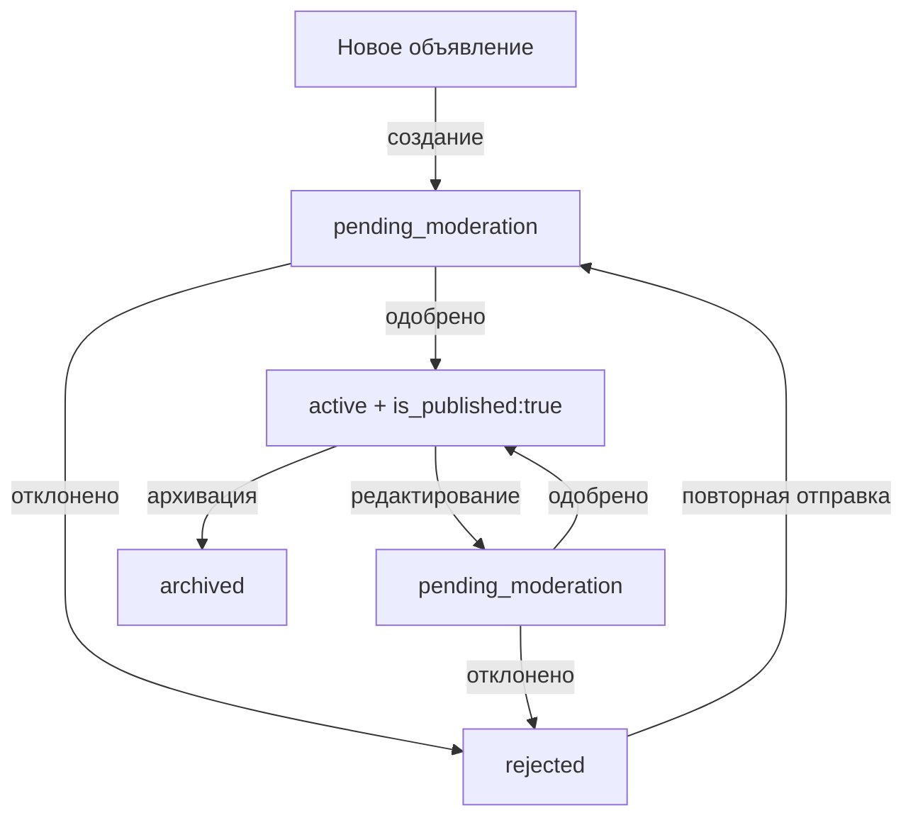

# Паттерн: Workflow модерации объявлений

## Описание
Система модерации объявлений с поддержкой первичной и повторной модерации после редактирования.

## Когда использовать
- Когда нужен контроль качества контента
- Когда изменения в опубликованном контенте требуют повторной проверки
- Когда нужна защита от спама и неподходящего контента

## Реализация

### 1. Статусы объявлений (Enum)
```php
enum AdStatus: string {
    case DRAFT = 'draft';
    case PENDING_MODERATION = 'pending_moderation';
    case ACTIVE = 'active';
    case REJECTED = 'rejected';
    case ARCHIVED = 'archived';
    case EXPIRED = 'expired';
    case BLOCKED = 'blocked';
}
```

### 2. Дополнительный флаг публикации
```php
// В модели Ad
protected $fillable = [
    'status',
    'is_published', // Флаг для отслеживания одобрения модератором
    // ...
];
```

### 3. Логика создания объявления
```php
// AdController::store()
$data = [
    'status' => AdStatus::PENDING_MODERATION->value,
    'is_published' => false,
    // ... остальные данные
];

$ad = $this->adService->create($data);
return redirect()->route('additem.success', ['ad' => $ad->id]);
```

### 4. Логика редактирования активного объявления
```php
// AdController::update()
if ($ad->status->value === 'active') {
    $data['status'] = AdStatus::PENDING_MODERATION->value;
    $data['is_published'] = false;
}

$updatedAd = $this->adService->update($ad, $data);

if ($updatedAd->status === AdStatus::PENDING_MODERATION) {
    return redirect('/profile/items/active/all');
}
```

### 5. Разрешение изменения статуса в сервисе
```php
// DraftService::saveOrUpdate()
if ($existingAd && isset($data['status'])) {
    // Разрешаем переход active -> pending_moderation
    if ($existingAd->status === AdStatus::ACTIVE &&
        $data['status'] === AdStatus::PENDING_MODERATION->value) {
        // Статус применится
    } elseif (/* другие условия */) {
        unset($data['status']); // Блокируем изменение
    }
}
```

### 6. Отображение статуса в UI
```vue
<!-- ItemStats.vue -->
<div v-if="(item.status === 'pending_moderation') ||
         (item.status === 'active' && item.is_published === false)"
     class="moderation-status">
  <span class="badge">На проверке</span>
</div>
```

### 7. Фильтрация в админ-панели
```php
// AdResource.php (Filament)
public static function getNavigationBadge(): ?string {
    $count = Ad::where('status', AdStatus::PENDING_MODERATION->value)
        ->orWhere(function($q) {
            $q->where('status', AdStatus::ACTIVE->value)
              ->where('is_published', false);
        })->count();
    return $count > 0 ? (string)$count : null;
}
```

### 8. Одобрение модератором
```php
// AdModerationService::approveAd()
$updateData = [
    'status' => AdStatus::ACTIVE->value,
    'is_published' => true,
    'published_at' => now(),
    'moderated_at' => now(),
    'moderation_reason' => null
];

$this->adRepository->updateAd($ad, $updateData);
```

## Состояния и переходы



## Преимущества паттерна

1. **Контроль качества** - все изменения проходят модерацию
2. **Прозрачность** - пользователь видит статус своего объявления
3. **Безопасность** - защита от спама и неподходящего контента
4. **Гибкость** - можно настроить автоматическую модерацию для доверенных пользователей

## Важные моменты

1. **Консистентность типов** - следите за типами возврата методов контроллера
2. **Импорты компонентов** - проверяйте правильность путей импорта
3. **Дублирование UI** - избегайте отображения одного статуса в нескольких местах
4. **Права доступа** - проверяйте авторизацию при редактировании

## Связанные паттерны
- State Machine Pattern - для управления переходами статусов
- Observer Pattern - для уведомлений об изменении статуса
- Strategy Pattern - для различных стратегий модерации