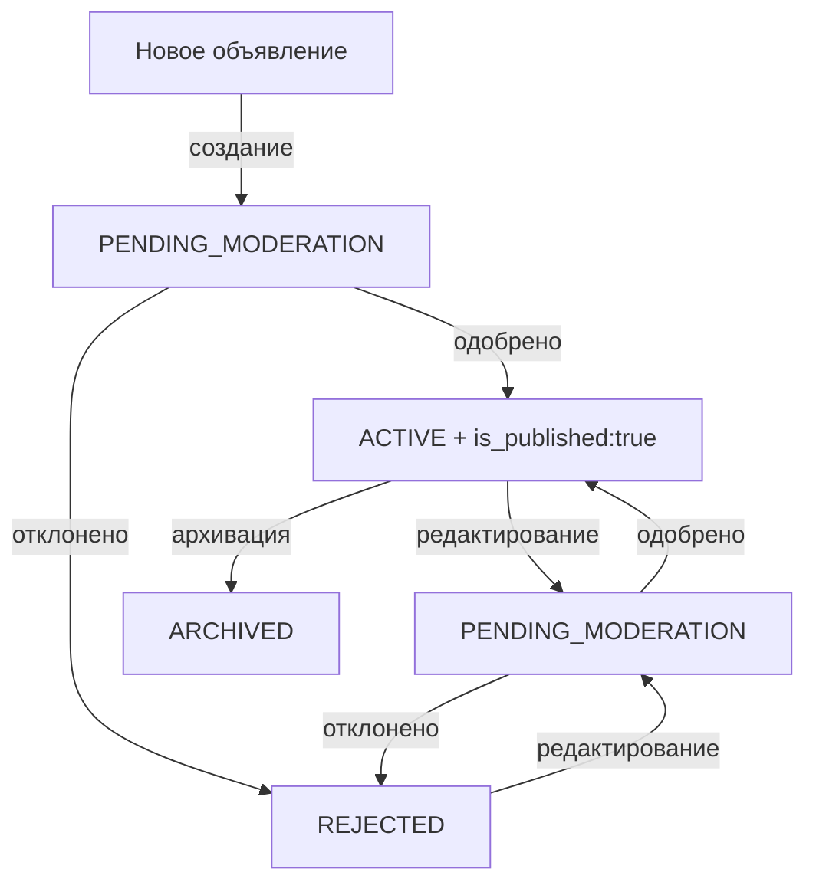

# Решение: Workflow модерации для отклоненных объявлений

## 🔴 Проблема

При редактировании **отклоненного** объявления (статус REJECTED):
- Объявление становилось **ACTIVE** вместо **PENDING_MODERATION**
- Пользователь редактирует объявление после отклонения модератором
- Сохранение → объявление появляется как активное в админке
- Ожидалось: объявление должно вернуться на модерацию (PENDING_MODERATION)

## 🔍 Диагностика

### Сценарий воспроизведения:
1. Админ отклоняет объявление → статус = `REJECTED`
2. Объявление попадает в "Ждут действий" в личном кабинете
3. Пользователь редактирует объявление
4. Пользователь сохраняет → объявление становится `ACTIVE` ❌

### Проблемное место найдено:

**AdController.php строки 294-302** (до исправления):
```php
// Если редактируется активное объявление - отправляем на модерацию
if ($ad->status->value === 'active') {
    $data['status'] = 'pending_moderation';
    $data['is_published'] = false;
}
```

**Проблема:** Проверяется ТОЛЬКО статус `active`!

Для объявлений со статусом `rejected` эта проверка **НЕ СРАБАТЫВАЕТ** → статус не изменяется → объявление сохраняется с текущим или неправильным статусом.

## ✅ Решение

### Изменение 1: AdController.php (строки 293-303)

**Было:**
```php
if ($ad->status->value === 'active') {
    $data['status'] = 'pending_moderation';
    $data['is_published'] = false;
}
```

**Стало:**
```php
// Если редактируется активное или отклоненное объявление - отправляем на модерацию
if (in_array($ad->status->value, ['active', 'rejected'])) {
    $data['status'] = 'pending_moderation';
    $data['is_published'] = false;
    \Log::info('🟢 AdController::update Объявление отправлено на модерацию', [
        'ad_id' => $ad->id,
        'old_status' => $ad->status->value,
        'new_status' => 'pending_moderation',
        'reason' => $ad->status->value === 'rejected' ? 'После отклонения' : 'Редактирование активного'
    ]);
}
```

**Почему работает:**
- Теперь проверяем ОБА статуса: `active` И `rejected`
- При редактировании отклоненного объявления устанавливаем `status = pending_moderation`
- Устанавливаем `is_published = false` (объявление не опубликовано до одобрения)
- Логируем причину отправки на модерацию

### Изменение 2: DraftService.php (строки 66-88)

**Было:**
```php
if ($existingAd->status === AdStatus::ACTIVE &&
    $data['status'] === AdStatus::PENDING_MODERATION->value) {
    // Разрешаем переход active -> pending_moderation при редактировании
}
```

**Стало:**
```php
// Разрешаем переход на модерацию при редактировании активных или отклоненных
if (in_array($existingAd->status->value, ['active', 'rejected']) &&
    $data['status'] === AdStatus::PENDING_MODERATION->value) {
    // Разрешаем переход active/rejected -> pending_moderation при редактировании
    // Статус остается в $data и будет применен
}
```

**Почему нужно:**
- Явно разрешаем переход `rejected -> pending_moderation`
- Согласуется с логикой в AdController
- Предотвращает случайное удаление статуса из данных

## 📊 Диаграмма переходов (обновлена)



## 💡 Почему это работает

### До исправления:
1. Админ отклоняет → `REJECTED`
2. Пользователь редактирует → AdController НЕ меняет статус (проверка только `active`)
3. DraftService сохраняет без изменения статуса
4. Результат: объявление остается `REJECTED` или становится `ACTIVE` ❌

### После исправления:
1. Админ отклоняет → `REJECTED`
2. Пользователь редактирует → AdController устанавливает `pending_moderation` + `is_published = false`
3. DraftService разрешает переход `rejected -> pending_moderation`
4. Результат: объявление возвращается на модерацию ✅

## 🎯 Результат

Теперь модерация работает правильно:
- ✅ Отклоненные объявления возвращаются на модерацию при редактировании
- ✅ Активные объявления возвращаются на модерацию при редактировании
- ✅ `is_published = false` для объявлений на модерации
- ✅ Логирование причин отправки на модерацию
- ✅ Соответствует документации workflow (Docs/PATTERNS/moderation-workflow.md)

## 🔗 Связанные файлы

- `app/Application/Http/Controllers/Ad/AdController.php` - основная логика обновления объявлений
- `app/Domain/Ad/Services/DraftService.php` - сервис сохранения и обновления черновиков
- `Docs/PATTERNS/moderation-workflow.md` - документация паттерна модерации
- `app/Domain/Ad/Services/AdModerationService.php` - сервис модерации объявлений

## 🏷️ Теги

#moderation #workflow #rejected #pending-moderation #admin #status-transitions #bug-fix

## 📅 Дата

2025-10-01

## ✅ Статус

Решено и задокументировано
