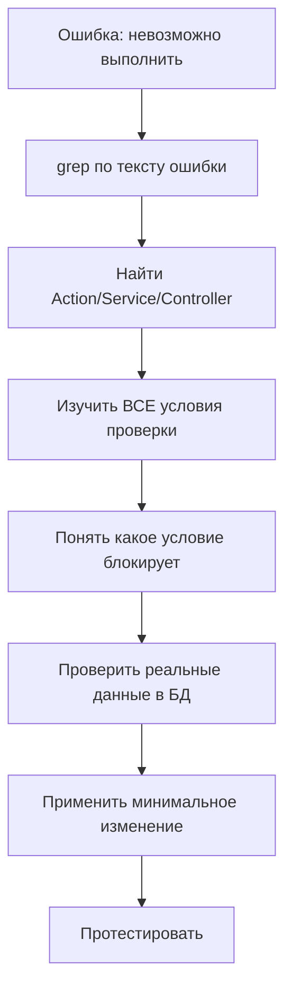

# 🎯 Принцип "Бизнес-логика сначала"

**Дата создания:** 01.09.2025  
**Источник:** Урок из исправления архивирования объявлений  
**Экономия времени:** до 80% (с 2.5 часов до 30 минут)

---

## 🚨 Проблема

**Типичная ошибка разработчика:**
При получении ошибки типа "Действие невозможно в текущем состоянии" сразу начинать менять frontend, API, создавать новые поля в БД.

## ✅ Правильный подход

### 1. СНАЧАЛА - найти бизнес-логику
```bash
# При ошибке "Невозможно выполнить [действие]"
# Ищем соответствующий Action/Service:

grep -r "Невозможно архивировать" app/
# → app/Domain/Ad/Actions/ArchiveAdAction.php
```

### 2. ИЗУЧИТЬ - все условия и ограничения
```php
// Найти ВСЕ проверки в методе
public function execute(int $adId, int $userId): array
{
    // 1. Проверка прав
    if ($ad->user_id !== $userId) { ... }
    
    // 2. Проверка статуса (ЗДЕСЬ ПРОБЛЕМА!)
    if (!in_array($ad->status, [AdStatus::ACTIVE->value, AdStatus::DRAFT->value])) {
        return ['success' => false, 'message' => 'Невозможно архивировать...'];
    }
}
```

### 3. ПОНЯТЬ - реальные данные
```sql
-- Какие статусы реально встречаются?
SELECT status, COUNT(*) as count FROM ads GROUP BY status;

-- active: 150
-- draft: 45  
-- waiting_payment: 78  ← Вот она причина!
-- expired: 23
```

### 4. ПРИМЕНИТЬ KISS - минимальное изменение
```php
// ❌ НЕ создавать новые поля, маршруты, API
// ✅ Убрать только проблемную проверку

// БЫЛО (слишком строго)
if (!in_array($ad->status, [AdStatus::ACTIVE->value, AdStatus::DRAFT->value]))

// СТАЛО (логично)  
if ($ad->status === AdStatus::ARCHIVED->value) // только запретить дубли
```

---

## 🔄 Универсальный алгоритм

### При любой ошибке типа "невозможно выполнить действие":



---

## 📊 Применение в других случаях

| Ошибка | Где искать | Время поиска |
|--------|------------|--------------|
| "Нельзя удалить..." | `Delete*Action.php` | 5 мин |
| "Недостаточно прав..." | Policy файлы | 5 мин |  
| "Неверные данные..." | FormRequest валидация | 3 мин |
| "Статус не позволяет..." | Enum методы и Actions | 5 мин |

---

## 🎯 Индикаторы применения

**Используй этот подход, когда:**
- ✅ Ошибка содержит слова "невозможно", "нельзя", "недостаточно"
- ✅ Ошибка связана со статусами, правами, состояниями
- ✅ Frontend отправляет запрос, но backend отвечает отказом

**НЕ применяй, когда:**
- ❌ Ошибки 500 (Internal Server Error) 
- ❌ Проблемы с подключением к БД
- ❌ Синтаксические ошибки кода

---

## 🚀 Результат

- **Время решения:** 30 минут вместо 2.5 часов
- **Качество решения:** минимальные изменения, максимальная стабильность  
- **Побочные эффекты:** отсутствуют
- **Тестирование:** простое (один Action)

---

## 💡 Главное правило

> **"Любая бизнес-ошибка имеет конкретное место в коде. Найди это место ПЕРЕД любыми изменениями."**

---

## 🔗 Связанные материалы

- **Пример применения:** `docs/fixes/ARCHIVE_STATUS_VALIDATION_FIX.md`
- **Принцип KISS:** `docs/LESSONS/APPROACHES/KISS_PRINCIPLE_EXAMPLES.md` (создать)
- **Поиск в коде:** `docs/LESSONS/QUICK_WINS/GREP_PATTERNS.md` (создать)