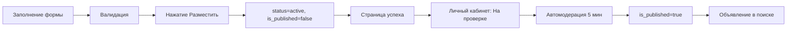

# 📋 Система модерации объявлений (как на Avito)

## 📊 Текущее состояние системы

### Существующие поля в БД (таблица `ads`)
- **`status`**: enum('draft', 'active', 'paused', 'archived') - статус объявления
- **`is_published`**: boolean - флаг публикации (false = на модерации, true = опубликовано)
- **`verification_status`**: enum('none', 'pending', 'verified', 'rejected') - статус верификации

### Текущая логика видимости
Объявление видно в поиске ТОЛЬКО если:
```php
status === 'active' && is_published === true
```

## 🎯 Целевой flow модерации



## 📝 Детальный план изменений

### 1. Изменение логики публикации

#### Frontend: `adFormModel.ts`
```typescript
// resources/js/src/features/ad-creation/model/adFormModel.ts
// В функции handleSubmit добавить:
const submitData = {
    ...form,
    is_published: false, // Добавить эту строку
    status: 'active'     // Убедиться что статус active
}
```

#### Backend: `AddItemController.php`
```php
// app/Application/Http/Controllers/AddItemController.php
public function store(Request $request)
{
    // Валидация...

    $ad = Ad::create([
        ...$validated,
        'status' => 'active',
        'is_published' => false, // На модерацию
        'created_at' => now()
    ]);

    // Запуск автомодерации через 5 минут
    AutoModerateAdJob::dispatch($ad)->delay(now()->addMinutes(5));

    // Redirect на страницу успеха
    return redirect()->route('additem.success', ['ad' => $ad->id]);
}
```

### 2. Страница успешной публикации

#### Новый файл: `Success.vue`
```vue
<!-- resources/js/src/pages/AddItem/Success.vue -->
<template>
  <div class="success-page max-w-4xl mx-auto p-6">
    <!-- Иконка успеха -->
    <div class="text-center mb-6">
      <div class="inline-flex items-center justify-center w-20 h-20 bg-green-100 rounded-full mb-4">
        <svg class="w-10 h-10 text-green-500" fill="currentColor" viewBox="0 0 20 20">
          <path d="M16.707 5.293a1 1 0 010 1.414l-8 8a1 1 0 01-1.414 0l-4-4a1 1 0 011.414-1.414L8 12.586l7.293-7.293a1 1 0 011.414 0z"/>
        </svg>
      </div>
      <h1 class="text-2xl font-bold text-gray-900 mb-2">
        Ваше объявление успешно добавлено!
      </h1>
    </div>

    <!-- Информация о модерации -->
    <div class="bg-blue-50 border border-blue-200 rounded-lg p-4 mb-6">
      <p class="text-gray-700">
        Объявление <strong>"{{ adTitle }}"</strong> добавлено на сайт.
      </p>
      <p class="text-gray-600 mt-2">
        Сейчас мы его проверяем. Как правило, это занимает пару минут,
        но в некоторых случаях нам нужно больше времени на проверку.
      </p>
      <p class="text-gray-600 mt-2">
        Вы всегда можете отредактировать или удалить своё объявление в
        <a href="/profile" class="text-blue-600 hover:underline">Личном кабинете</a>.
      </p>
    </div>

    <!-- Блок продвижения -->
    <div class="bg-gradient-to-br from-purple-50 to-blue-50 border border-purple-200 rounded-lg p-6 mb-6">
      <h3 class="text-lg font-semibold text-gray-900 mb-3">
        🚀 Получайте больше просмотров
      </h3>
      <p class="text-gray-700 mb-4">
        Потенциальные покупатели будут видеть ваше объявление чаще,
        чем похожие предложения конкурентов
      </p>
      <div class="flex gap-3">
        <button @click="promoteAd"
                class="px-6 py-3 bg-gradient-to-r from-purple-600 to-blue-600 text-white font-semibold rounded-lg hover:shadow-lg transition">
          Поднять просмотры - 500₽
        </button>
        <button @click="skipPromotion"
                class="px-6 py-3 bg-white text-gray-700 font-semibold rounded-lg border border-gray-300 hover:bg-gray-50 transition">
          Пропустить
        </button>
      </div>
    </div>

    <!-- Действия -->
    <div class="text-center">
      <Link href="/profile/items/active"
            class="inline-flex items-center px-6 py-3 bg-green-600 text-white font-semibold rounded-lg hover:bg-green-700 transition">
        Перейти в Личный кабинет
        <svg class="w-5 h-5 ml-2" fill="none" stroke="currentColor" viewBox="0 0 24 24">
          <path stroke-linecap="round" stroke-linejoin="round" stroke-width="2" d="M13 7l5 5m0 0l-5 5m5-5H6"/>
        </svg>
      </Link>
    </div>
  </div>
</template>

<script setup>
import { Link } from '@inertiajs/vue3'
import { router } from '@inertiajs/vue3'

const props = defineProps({
  ad: Object
})

const adTitle = props.ad?.title || 'Ваше объявление'

const promoteAd = () => {
  router.post(`/ads/${props.ad.id}/promote`, {
    type: 'boost',
    duration: 7,
    price: 500
  })
}

const skipPromotion = () => {
  router.visit('/profile/items/active')
}
</script>
```

### 3. Автоматическая модерация

#### Новый Job: `AutoModerateAdJob.php`
```php
<?php

namespace App\Jobs;

use App\Domain\Ad\Models\Ad;
use Illuminate\Bus\Queueable;
use Illuminate\Contracts\Queue\ShouldQueue;
use Illuminate\Foundation\Bus\Dispatchable;
use Illuminate\Queue\InteractsWithQueue;
use Illuminate\Queue\SerializesModels;
use Illuminate\Support\Facades\Log;

class AutoModerateAdJob implements ShouldQueue
{
    use Dispatchable, InteractsWithQueue, Queueable, SerializesModels;

    protected $ad;

    public function __construct(Ad $ad)
    {
        $this->ad = $ad;
    }

    public function handle()
    {
        // Проверяем, что объявление все еще ждет модерации
        if ($this->ad->status !== 'active' || $this->ad->is_published === true) {
            Log::info('Ad already moderated', ['ad_id' => $this->ad->id]);
            return;
        }

        // Простая проверка на запрещенные слова
        if ($this->passesAutoModeration()) {
            // Одобряем объявление
            $this->ad->update([
                'is_published' => true,
                'moderated_at' => now()
            ]);

            Log::info('Ad auto-approved', ['ad_id' => $this->ad->id]);
        } else {
            // Отправляем на ручную модерацию
            Log::warning('Ad requires manual moderation', ['ad_id' => $this->ad->id]);
        }
    }

    private function passesAutoModeration(): bool
    {
        $bannedWords = [
            'запрещенное_слово',
            'спам',
            // Добавить список запрещенных слов
        ];

        $textToCheck = strtolower(
            $this->ad->title . ' ' .
            $this->ad->description . ' ' .
            $this->ad->services_additional_info
        );

        foreach ($bannedWords as $word) {
            if (str_contains($textToCheck, strtolower($word))) {
                return false;
            }
        }

        return true;
    }
}
```

### 4. Отображение статусов в личном кабинете

#### Обновление компонента списка объявлений
```vue
<!-- В компоненте отображения объявления -->
<template>
  <div class="ad-status">
    <!-- На проверке -->
    <span v-if="ad.status === 'active' && !ad.is_published"
          class="inline-flex items-center px-2.5 py-0.5 rounded-full text-xs font-medium bg-yellow-100 text-yellow-800">
      <svg class="w-3 h-3 mr-1" fill="currentColor" viewBox="0 0 20 20">
        <path d="M10 18a8 8 0 100-16 8 8 0 000 16zm1-12a1 1 0 10-2 0v4a1 1 0 00.293.707l2.828 2.829a1 1 0 101.415-1.415L11 9.586V6z"/>
      </svg>
      На проверке
    </span>

    <!-- Активное -->
    <span v-else-if="ad.status === 'active' && ad.is_published"
          class="inline-flex items-center px-2.5 py-0.5 rounded-full text-xs font-medium bg-green-100 text-green-800">
      <svg class="w-3 h-3 mr-1" fill="currentColor" viewBox="0 0 20 20">
        <path d="M16.707 5.293a1 1 0 010 1.414l-8 8a1 1 0 01-1.414 0l-4-4a1 1 0 011.414-1.414L8 12.586l7.293-7.293a1 1 0 011.414 0z"/>
      </svg>
      Активно
    </span>

    <!-- Черновик -->
    <span v-else-if="ad.status === 'draft'"
          class="inline-flex items-center px-2.5 py-0.5 rounded-full text-xs font-medium bg-gray-100 text-gray-800">
      Черновик
    </span>
  </div>
</template>
```

### 5. Маршруты

#### Добавить в `routes/web.php`
```php
// Страница успешной публикации
Route::get('/additem/success/{ad}', [AddItemController::class, 'success'])
    ->name('additem.success')
    ->middleware(['auth']);

// Продвижение объявления
Route::post('/ads/{ad}/promote', [PromotionController::class, 'promote'])
    ->name('ads.promote')
    ->middleware(['auth']);
```

## 🧪 Тестирование

### Сценарий тестирования
1. ✅ Заполнить все обязательные поля формы
2. ✅ Нажать "Разместить объявление"
3. ✅ Проверить переход на `/additem/success/{id}`
4. ✅ Проверить текст "На проверке" в личном кабинете
5. ✅ Убедиться что объявление НЕ видно в поиске
6. ✅ Подождать 5 минут (или выполнить job вручную)
7. ✅ Проверить изменение статуса на "Активно"
8. ✅ Убедиться что объявление появилось в поиске

### Команды для тестирования
```bash
# Запуск очереди для обработки jobs
php artisan queue:work

# Ручной запуск модерации (для тестов)
php artisan tinker
>>> $ad = \App\Domain\Ad\Models\Ad::latest()->first();
>>> \App\Jobs\AutoModerateAdJob::dispatchNow($ad);
```

## 📈 Метрики успеха

- ✅ Объявления не появляются в поиске сразу после публикации
- ✅ Пользователи видят статус "На проверке"
- ✅ Автоматическая модерация работает через 5 минут
- ✅ После модерации объявления появляются в поиске
- ✅ Страница успеха показывает предложение продвижения

## ❓ FAQ

**Q: Сколько времени занимает модерация?**
A: Обычно 5 минут для автоматической проверки

**Q: Можно ли редактировать объявление во время модерации?**
A: Да, но после редактирования модерация начнется заново

**Q: Что делать если объявление не прошло модерацию?**
A: Проверьте текст на запрещенные слова и отредактируйте

## 🔄 Дальнейшие улучшения

1. Добавить ручную модерацию для сомнительных объявлений
2. Настроить уведомления о прохождении модерации
3. Добавить статистику времени модерации
4. Реализовать приоритетную модерацию для VIP пользователей